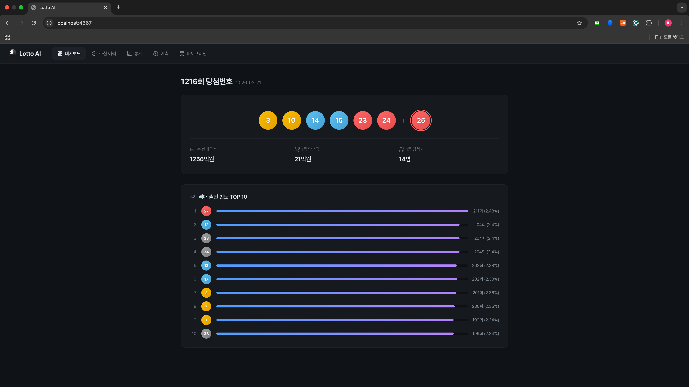
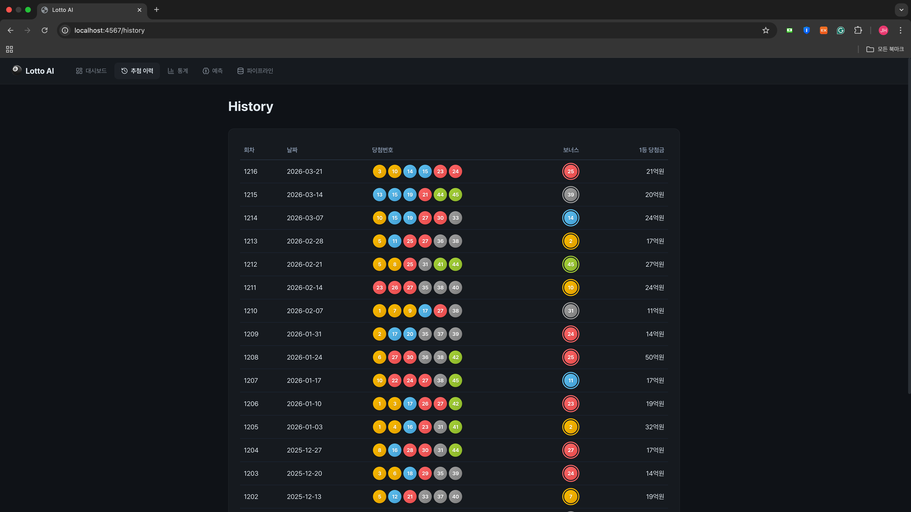
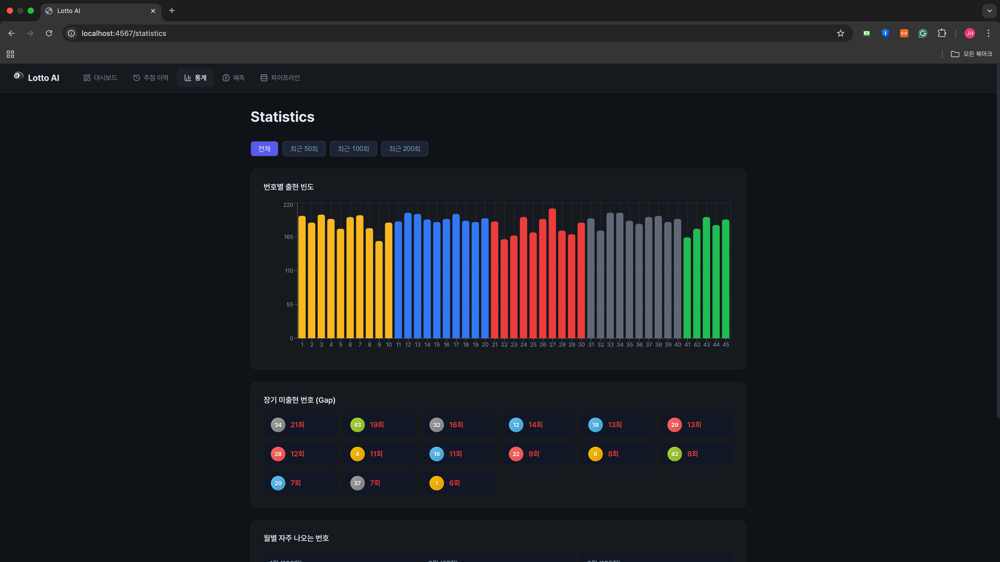
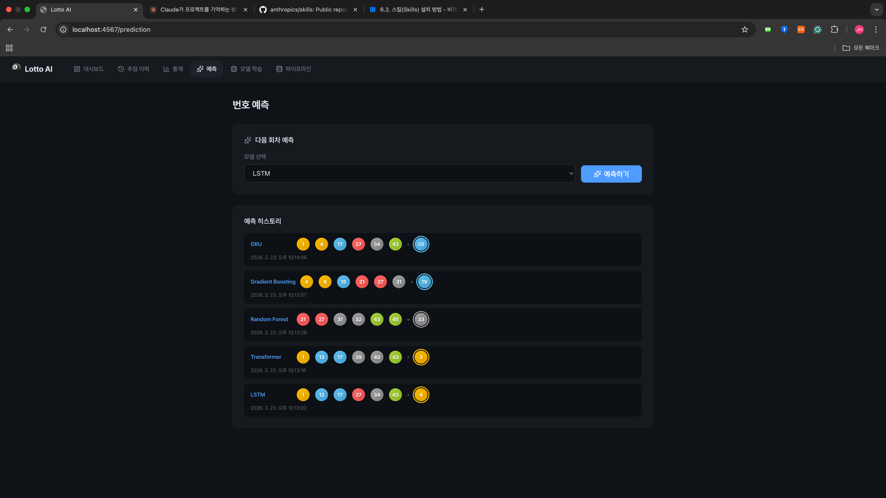
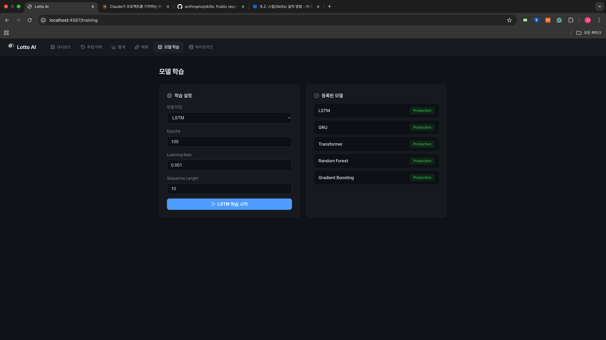
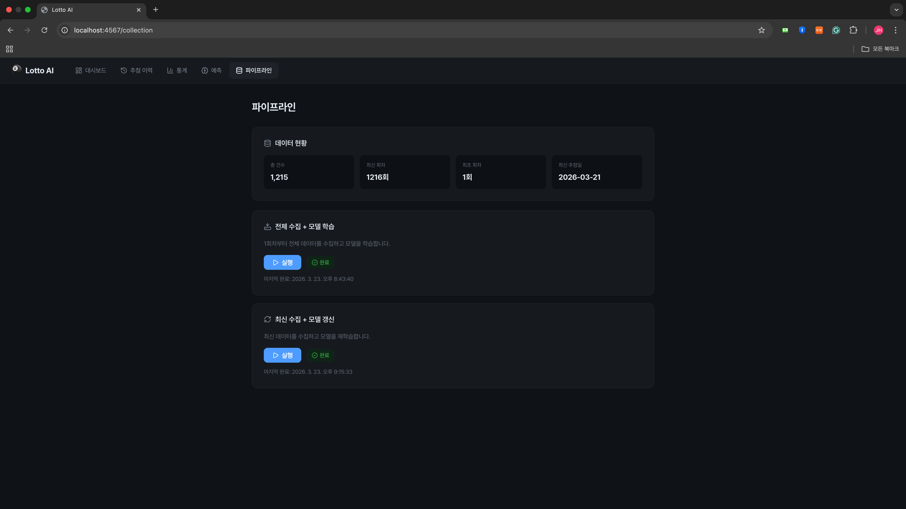

# Lotto Prediction Service
딥러닝 기반 로또 번호 예측 서비스. 데이터 수집 → 모델 학습 → Registry 배포 → 예측 서빙까지 전체 MLOps 파이프라인을 Docker Compose로 구성한 토이 프로젝트입니다.








## Architecture

```
                          ┌──────────────────────────────┐
                          │     Nginx (:4567 → :80)      │
                          │       Reverse Proxy          │
                          └──────┬───┬───┬───┬───────────┘
                                 │   │   │   │
                 ┌───────────────┘   │   │   └───────────────┐
                 ▼                   ▼   ▼                   ▼
          ┌─────────────┐  ┌──────────┐ ┌──────────┐  ┌───────────┐
          │  Frontend   │  │ Backend  │ │ Airflow  │  │  MLflow   │
          │  React/TS   │  │ FastAPI  │ │ Web UI   │  │ Tracking  │
          │  :80        │  │ :8000    │ │ :8080    │  │ + Registry│
          └─────────────┘  └────┬─────┘ └────┬─────┘  │ :5000     │
                                │            │        └─────┬─────┘
                   ┌────────────┘            │              │
                   ▼                         ▼              │
          ┌────────────────┐           ┌──────────┐         │
          │   ML Service   │           │ Scheduler│         │
          │   FastAPI      │◄──────────│  (DAGs)  │         │
          │   :8100        │           └──────────┘         │
          │                │                                │
          │  train/predict │◄───────────────────────────────┘
          │  Registry      │     model insert/get
          └───────┬────────┘
                  │
        ┌─────────┴─────────┐
        ▼                   ▼
  ┌──────────┐        ┌──────────┐
  │ MongoDB  │        │PostgreSQL│
  │  :27017  │        │  :5432   │
  └──────────┘        └──────────┘
   draws,              Airflow DB
  predictions          MLflow DB
```

## Services (10 containers)

| 컨테이너 | 이미지/빌드 | 역할 | 포트 |
|-----------|-------------|------|------|
| **nginx** | nginx:1.25 | 리버스 프록시, 라우팅 | 4567→80 |
| **frontend** | React 18 + Vite | SPA (대시보드, 통계, 예측, 파이프라인) | 80 |
| **backend** | FastAPI | API 게이트웨이, ML Service 프록시 | 8000 |
| **ml-service** | FastAPI + PyTorch | 모델 학습, 추론, MLflow Registry 관리 | 8100 |
| **mongodb** | mongo:7.0 | 추첨 데이터, 예측 기록 | 27017 |
| **postgres** | postgres:15 | Airflow + MLflow 메타데이터 | 5432 |
| **mlflow** | MLflow 2.10 | 실험 추적 + **Model Registry** | 5000 |
| **airflow-webserver** | Airflow 2.8 | DAG 관리 UI, REST API | 8080 |
| **airflow-scheduler** | Airflow 2.8 | DAG 실행 엔진 | - |
| **airflow-init** | Airflow 2.8 | DB 마이그레이션 (일회성) | - |

## ML Pipeline

```
동행복권 API                 Airflow DAG
(dhlottery.co.kr)   ──→   (lotto_backfill / lotto_weekly_collect)
                                  │
                     ┌────────────┼────────────┬───────────────┐
                     ▼            ▼            ▼               ▼
               collect_draws  train_models  promote_models  log_summary
               (데이터 수집)   (5개 모델)    (Staging→Prod)  (요약)
                     │            │            │
                     ▼            ▼            ▼
                 MongoDB      MLflow        MLflow
                draws 컬렉션   실험 기록    Model Registry
                              + Registry     Production
                              (Staging)      배포 완료
```

### Model Registry Lifecycle

```
학습 완료 → Registry 등록 (Staging)
                 │
         promote_models task
                 │
                 ▼
        기존 Production → Archived
        Staging → Production ← 예측 시 이 모델 로드
```

### DAG 스케줄
- `lotto_backfill` — 수동 트리거: 전체 수집 → 학습 → 배포
- `lotto_weekly_collect` — 매주 일요일 12:00 KST: 최신 수집 → 재학습 → 배포

## ML Models

| 모델 | 프레임워크 | 구조 | Registry 이름 |
|------|-----------|------|--------------|
| **LSTM** | PyTorch | 2-layer LSTM → FC(128→256→128→45) | `lotto-lstm` |
| **GRU** | PyTorch | 2-layer GRU → FC(128→256→45) | `lotto-gru` |
| **Transformer** | PyTorch | Multi-head Attention (d=64, 4head) | `lotto-transformer` |
| **Random Forest** | scikit-learn | 앙상블 (100 trees) | `lotto-random-forest` |
| **Gradient Boosting** | scikit-learn | 순차 부스팅 | `lotto-gradient-boosting` |

**학습 데이터 형식:**
```
입력: 최근 10회차 × 7차원 (번호6 + 보너스1), 0~1 정규화
타겟: 45차원 multi-hot 벡터 (해당 번호 위치 = 1)
손실: BCELoss (Binary Cross Entropy)
```

## API Endpoints

### Backend (API Gateway) — `:8000`

#### 로또 데이터
| Method | Path | 설명 |
|--------|------|------|
| GET | `/api/lotto` | 추첨 이력 (페이지네이션) |
| GET | `/api/lotto/latest` | 최신 회차 |
| GET | `/api/lotto/{draw_no}` | 특정 회차 조회 |

#### 통계
| Method | Path | 설명 |
|--------|------|------|
| GET | `/api/stats/frequency` | 번호별 출현 빈도 |
| GET | `/api/stats/monthly` | 월별 통계 |
| GET | `/api/stats/gaps` | 번호별 미출현 간격 |

#### 예측 & 학습 (→ ML Service 프록시)
| Method | Path | 설명 |
|--------|------|------|
| POST | `/api/predict?model_type=lstm` | 다음 회차 예측 (Registry Production 모델) |
| POST | `/api/train` | 모델 학습 → Registry 등록 (Staging) |
| GET | `/api/predictions` | 예측 히스토리 |
| GET | `/api/models` | Registry에 등록된 모델 목록 |

#### MLOps & Registry (→ ML Service 프록시)
| Method | Path | 설명 |
|--------|------|------|
| GET | `/api/mlops/experiments` | MLflow 실험 목록 |
| GET | `/api/mlops/runs` | 실험 실행 기록 |
| GET | `/api/mlops/compare` | 모델별 성능 비교 |
| GET | `/api/mlops/registry` | Registry 모델 목록 (Production) |
| GET | `/api/mlops/registry/{name}/versions` | 모델 버전 이력 |
| POST | `/api/mlops/registry/{name}/promote` | 최신 Staging → Production 승격 |

#### 수집 관리 (Airflow 연동)
| Method | Path | 설명 |
|--------|------|------|
| GET | `/api/collection/status` | DB 수집 상태 |
| POST | `/api/collection/trigger/{dag_id}` | DAG 실행 (중복 방지) |
| GET | `/api/collection/dag-status/{dag_id}` | DAG 실행 상태 |

#### WebSocket
| Path | 설명 |
|------|------|
| `/api/ws/logs/{dag_id}/{run_id}` | DAG 실행 로그 실시간 스트리밍 |
| `/api/ws/train/{session_id}` | 학습 로그 실시간 스트리밍 (→ ML Service 릴레이) |

### ML Service (내부) — `:8100`

| Method | Path | 설명 |
|--------|------|------|
| POST | `/ml/predict` | 모델 추론 (Registry에서 로드) |
| POST | `/ml/train` | 모델 학습 + Registry 등록 |
| GET | `/ml/models` | Registry 모델 목록 |
| GET | `/ml/models/{name}/versions` | 버전 이력 |
| POST | `/ml/models/{name}/versions/{v}/stage` | 스테이지 전이 |
| POST | `/ml/models/{name}/promote-latest` | Staging → Production |
| GET | `/ml/experiments` | MLflow 실험 |
| GET | `/ml/runs` | MLflow 실행 기록 |
| GET | `/ml/compare` | 모델 비교 |
| WS | `/ml/ws/train/{session_id}` | 학습 로그 WebSocket |

## Quick Start

```bash
# 1. 환경변수 설정
cp .env.example .env
# .env 파일에서 비밀번호와 키를 설정

# 2. 전체 서비스 실행
docker compose up -d

# 3. 접속
# 웹 UI:     http://localhost:4567
# Airflow:   http://localhost:4567/airflow  (admin/admin)
# MLflow:    http://localhost:4567/mlflow
# API 문서:  http://localhost:4567/docs
```

데이터 수집 → 모델 학습 → 배포를 한번에 실행하려면, 웹 UI의 **파이프라인** 페이지에서 "전체 수집" 버튼을 클릭하세요. Airflow DAG이 자동으로 수집 → 학습 → Staging 등록 → Production 승격까지 처리합니다.

## Project Structure

```
lotto/
├── docker-compose.yml          # 10개 서비스 오케스트레이션
├── .env.example                # 환경변수 템플릿
│
├── nginx/                      # 리버스 프록시
│   └── nginx.conf              # 라우팅 (/api, /airflow, /mlflow, /)
│
├── frontend/                   # React SPA
│   └── src/
│       ├── pages/              # Dashboard, History, Statistics, Prediction, Collection
│       ├── components/         # Navbar, LottoBall, Card, LogViewer, FloatingLogPanel
│       ├── hooks/              # useLogStream (WebSocket)
│       └── api/client.ts       # API 클라이언트
│
├── backend/                    # API Gateway (경량 프록시)
│   └── app/
│       ├── routers/            # lotto, stats, prediction, mlops, collection, ws
│       ├── services/           # ML Service 프록시, 수집 상태 조회
│       └── db/                 # MongoDB 연결
│
├── ml-service/                 # ML 전용 서비스
│   └── app/
│       ├── routers/            # predict, train, models, mlops, ws
│       └── services/
│           ├── prediction_service.py  # Registry 모델 로드 → 추론
│           ├── training_service.py    # 학습 + Registry 등록
│           └── registry_service.py    # MLflow Model Registry 래퍼
│
├── ml/                         # 머신러닝 코드 (ml-service에 마운트)
│   ├── model/                  # LSTM, GRU, Transformer, sklearn 정의
│   ├── train.py                # 학습 스크립트 (MLflow 트래킹)
│   └── predict.py              # 추론 유틸리티
│
├── airflow/                    # 데이터 파이프라인
│   └── dags/
│       └── lotto_collect_dag.py  # 수집 → 학습 → 승격 → 요약
│
├── mlflow/                     # MLflow 서버 + Model Registry
│   ├── Dockerfile
│   └── entrypoint.sh
│
└── mongo-init/
    └── init.js
```

## Tech Stack

| Layer | Technology |
|-------|-----------|
| Frontend | React 18, TypeScript, Vite, Recharts, Lucide Icons, Pretendard |
| API Gateway | FastAPI, Uvicorn, httpx (프록시), WebSocket 릴레이 |
| ML Service | FastAPI, PyTorch 2.2, scikit-learn 1.4, MLflow 2.10 |
| MLOps | MLflow Model Registry (Staging → Production), Airflow 2.8 |
| Database | MongoDB 7.0 (Motor async), PostgreSQL 15 |
| Realtime | WebSocket (FastAPI native) |
| Infra | Docker Compose (10 containers), Nginx |
